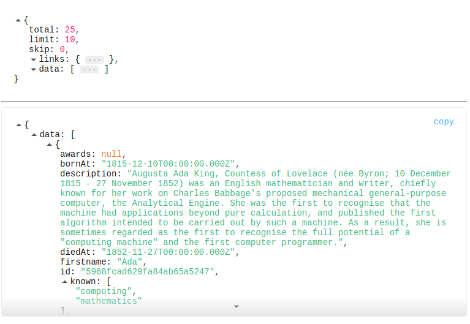

# vue-json-viewer

简单易用的json内容展示组件，支持vue@2和3，支持SSR，组件支持增量渲染即使大文件json也可以快速渲染。

原作者： chenfengjw163

[](https://travis-ci.org/chenfengjw163/vue-json-viewer)
[](https://www.npmjs.com/package/vue-json-viewer)


- [安装](#安装)
- [示例](#示例)
- [选项](#选项)
- [主题](#主题)

## 安装
使用 npm:
```
$ npm install vue-json-viewer@2 --save
// Vue2
$ npm install vue-json-viewer@3 --save
// Vue3
```

使用 yarn:
```
$ yarn add vue-json-viewer@2 
// Vue2
$ yarn add vue-json-viewer@3 
// Vue3
```

## 示例

``` html
<json-viewer :value="jsonData"></json-viewer>

<hr />

<json-viewer
  :value="jsonData"
  :expand-depth=5
  copyable
  boxed
  sort></json-viewer>
```

``` js
import Vue from 'vue'
import JsonViewer from 'vue-json-viewer'

// Import JsonViewer as a Vue.js plugin
Vue.use(JsonViewer)
// or 
// components: {JsonViewer}


new Vue({
  el: '#app',
  data() {
    return {
      jsonData: {
        total: 25,
        limit: 10,
        skip: 0,
        links: {
          previous: undefined,
          next: function () {},
        },
        data: [
          {
            id: '5968fcad629fa84ab65a5247',
            firstname: 'Ada',
            lastname: 'Lovelace',
            awards: null,
            known: [
              'mathematics',
              'computing'
            ],
            position: {
              lat: 44.563836,
              lng: 6.495139
            },
            description: `Augusta Ada King, Countess of Lovelace (née Byron; 10 December 1815 – 27 November 1852) was an English mathematician and writer,
            chiefly known for her work on Charles Babbage's proposed mechanical general-purpose computer,
            the Analytical Engine. She was the first to recognise that the machine had applications beyond pure calculation,
            and published the first algorithm intended to be carried out by such a machine.
            As a result, she is sometimes regarded as the first to recognise the full potential of a "computing machine" and the first computer programmer.`,
            bornAt: '1815-12-10T00:00:00.000Z',
            diedAt: '1852-11-27T00:00:00.000Z'
          }, {
            id: '5968fcad629fa84ab65a5246',
            firstname: 'Grace',
            lastname: 'Hopper',
            awards: [
              'Defense Distinguished Service Medal',
              'Legion of Merit',
              'Meritorious Service Medal',
              'American Campaign Medal',
              'World War II Victory Medal',
              'National Defense Service Medal',
              'Armed Forces Reserve Medal',
              'Naval Reserve Medal',
              'Presidential Medal of Freedom'
            ],
            known: null,
            position: {
              lat: 43.614624,
              lng: 3.879995
            },
            description: `Grace Brewster Murray Hopper (née Murray; December 9, 1906 – January 1, 1992)
            was an American computer scientist and United States Navy rear admiral.
            One of the first programmers of the Harvard Mark I computer,
            she was a pioneer of computer programming who invented one of the first compiler related tools.
            She popularized the idea of machine-independent programming languages, which led to the development of COBOL,
            an early high-level programming language still in use today.`,
            bornAt: '1815-12-10T00:00:00.000Z',
            diedAt: '1852-11-27T00:00:00.000Z'
          }
        ]
      }
    }
  }
})
```
### 支持SSR
``` js
import JsonViewer from 'vue-json-viewer/ssr'

// Import JsonViewer as a Vue.js plugin
Vue.use(JsonViewer)
// or 
// components: {JsonViewer}
```
and

``` js
import 'vue-json-viewer/style.css'
```


### 图片预览



## 选项

| 属性 | 描述 | 默认值 |
| ----------- |:------------- | ----------- |
| `value` | json对象的值，可以使用v-model，支持响应式 | **必填** |
| `expand-depth` | 默认展开的层级 | `1`  |
| `copyable` | 展示复制按钮，默认文案为：copy、copied!, 你可以设置一个对象`{copyText: 'copy', copiedText: 'copied'}` 来自定义复制按钮文案 | `false`  |
| `sort` | 按照key排序展示 | `false` |
| `boxed` | 为组件添加一个盒样式 | `false` |
| `theme` | 添加一个自定义的样式class用作主题 | `jv-light` |
| `expanded` | 默认展开视图 | `false` |
| `timeformat` | 自定义时间格式函数 | time => time.toLocaleString() |
| `preview-mode` | 不可折叠模式，默认全部展开 | `false` |
| `show-array-index` | 是否显示数组索引 | `true` |
| `show-double-quotes` | 展示key双引号 | `false` |
| `decorator` | 装饰渲染的value值 | `null` |


## 事件

| 事件 | 描述 | 值 |
| ----------- |:------------- | ----------- |
| `copied` | 复制文本后的事件 |  |
| `keyclick` | 点击key的事件 |  |

## Slots

| 名称 | 描述 | Scope |
| ----------- |:------------- | ----------- |
| `copy` | 自定义拷贝按钮 | `{copied: boolean}` |

## 快捷键
| 名称 | 描述 | 
| ----------- |:------------- | 
| `alt` + click | 展开当前节点下的所有节点 | 

## 主题

有两个办法创建自定义主题, (e.g. `my-awesome-json-theme`):
1. 添加 `theme="my-awesome-json-theme"` JsonViewer的组件属性
2. 复制粘贴下面的模板并且根据自定义的theme名称做对应调整:

``` scss
// values are default one from jv-light template
.my-awesome-json-theme {
  background: #fff;
  white-space: nowrap;
  color: #525252;
  font-size: 14px;
  font-family: Consolas, Menlo, Courier, monospace;

  .jv-ellipsis {
    color: #999;
    background-color: #eee;
    display: inline-block;
    line-height: 0.9;
    font-size: 0.9em;
    padding: 0px 4px 2px 4px;
    border-radius: 3px;
    vertical-align: 2px;
    cursor: pointer;
    user-select: none;
  }
  .jv-button { color: #49b3ff }
  .jv-key { color: #111111 }
  .jv-item {
    &.jv-array { color: #111111 }
    &.jv-boolean { color: #fc1e70 }
    &.jv-function { color: #067bca }
    &.jv-number { color: #fc1e70 }
    &.jv-number-float { color: #fc1e70 }
    &.jv-number-integer { color: #fc1e70 }
    &.jv-object { color: #111111 }
    &.jv-undefined { color: #e08331 }
    &.jv-string {
      color: #42b983;
      word-break: break-word;
      white-space: normal;
    }
  }
  .jv-code {
    .jv-toggle {
      &:before {
        padding: 0px 2px;
        border-radius: 2px;
      }
      &:hover {
        &:before {
          background: #eee;
        }
      }
    }
  }
}
```
